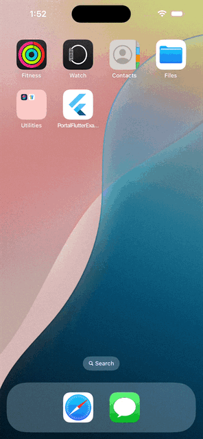

# Portal Flutter SDK Example

This repository demonstrates how to integrate and use the Portal iOS and Portal Android SDK in a Flutter application. It provides a complete wallet management interface with backup and recovery capabilities, showcasing a production-ready implementation for developers.

## 🚀 What's Included

- **Complete Wallet Management**: Create, backup, and recover wallets
- **Token Swapping**: Swap tokens using Portal's swap functionality (iOS only)
- **Cross-Platform Support**: Full iOS and Android implementation




---

## ✨ Features

- **🔐 Wallet Creation**: Generate wallets with Ethereum and Solana addresses
- **💾 Secure Backup**: Password-encrypted wallet backup to Portal servers
- **🔄 Wallet Recovery**: Restore wallets using password authentication
- **🔄 Token Swapping**: Swap tokens using Portal's swap functionality
- **📱 Cross-Platform**: Identical functionality on iOS and Android
- **⚡ Loading States**: Professional UI with loading indicators for all operations

---

## 📋 Prerequisites

1. **Flutter Setup**: Ensure Flutter is installed on your system. Refer to the [Flutter installation guide](https://docs.flutter.dev/get-started/install).
2. **iOS Environment**: Xcode must be installed for iOS development.
3. **Android Environment**: Follow [the official Flutter guide](https://docs.flutter.dev/get-started/install/macos/mobile-android) on setting up Android for Flutter.
4. **Portal API Key**: Obtain your Client API key from the [Portal Dashboard](https://app.portalhq.io/dashboard).
5. **Development Environment**: 
   - iOS: macOS with Xcode 14+
   - Android: Android Studio with SDK 21+

---

## Getting Started

### 1. Clone the Repository

```bash
git clone https://github.com/portal-hq/portal_flutter.git
cd portal_flutter
```


### 2. Install Dependencies
Ensure all required Flutter dependencies are installed:

```bash
flutter pub get
```


### 3. Configure the API Key
Update the API key in `lib/constants.dart` with your Portal client API key:

```dart
const String clientAPIKey = "your-api-key-here";
```

The app will automatically use this key when initializing the Portal SDK.


### 4. Run the App
Run the Flutter app on your preferred platform:

```bash
# Run on iOS simulator
flutter run -d ios

# Run on Android emulator
flutter run -d android

# Run on connected device
flutter run
```

### 5. Test the Features
1. **Create Wallet**: Generate a new wallet with Ethereum and Solana addresses
2. **Backup Wallet**: Set a password and backup your wallet
3. **Recover Wallet**: Test wallet recovery using your password
4. **Swap Tokens**: Test token swapping (iOS only)


---

## 🔧 Technical Implementation

### Method Channel Architecture
All native SDK operations are handled through Flutter's `MethodChannel` system, ensuring seamless communication between Dart and native code.

#### 1. Portal SDK Initialization
Initialize the Portal SDK with your API key and configuration options.

**Method Channel:** `portal_flutter/portal`  
**Method:** `initializePortal`  
**Parameters:** `{apiKey: String, autoApprove: Boolean}`  
**Returns:** `{success: boolean, message: string}`

#### 2. Wallet Creation
Create a new wallet with Ethereum and Solana addresses. Handles existing wallet scenarios gracefully.

**Method Channel:** `portal_flutter/portal`  
**Method:** `createWallet`  
**Returns:** `{addresses: {ethereum: String, solana: String}}`

#### 3. Wallet Backup
Backup wallet using password-based encryption with secure Portal SDK mechanisms.

**Method Channel:** `portal_flutter/portal`  
**Method:** `backupWallet`  
**Parameters:** `method: String` (e.g., "Password")  
**Returns:** `boolean` (success status)

#### 4. Wallet Recovery
Recover previously backed up wallet using password authentication.

**Method Channel:** `portal_flutter/portal`  
**Method:** `recoverWallet`  
**Parameters:** `method: String` (e.g., "Password")  
**Returns:** `{success: boolean, addresses: {ethereum: String, solana: String}}`

#### 5. Password Management
Secure password handling for all backup and recovery operations.

**Method Channel:** `portal_flutter/portal`  
**Method:** `setPassword`  
**Parameters:** `password: String`  
**Returns:** `boolean` (success status)

#### 6. Recovery Availability Check
Check if password-based recovery is available for the current wallet state.

**Method Channel:** `portal_flutter/portal`  
**Method:** `isPasswordRecoverAvailable`  
**Returns:** `boolean` (availability status)

#### 7. Token Swapping
Swap tokens using Portal's swap functionality (iOS only). Android returns a "not supported" error.

**Method Channel:** `portal_flutter/portal`  
**Method:** `swap`  
**Parameters:** `{swapsApiKey: String, chainId: String, buyToken: String, sellToken: String, amount: String}`  
**Returns:** `{success: boolean, transactionHash: String}` (iOS) or error (Android)

**Note:** The UI provides pre-filled defaults:
- **Buy Token**: USDC
- **Sell Token**: ETH  
- **Amount**: 10000000000000 Wei (0.00001 ETH)
- **Chain ID**: eip155:8453 (Base)

---

## 🏗️ Architecture

### Cross-Platform Implementation
Feature parity between iOS and Android platforms:

- **iOS**: PortalSwift SDK with Swift (full functionality including swaps)
- **Android**: Portal Android SDK with Kotlin (wallet management only, swaps not supported in this example so far)
- **Flutter**: Dart UI layer with MethodChannel communication

### Error Handling
- Comprehensive error management across all operations
- User-friendly error messages and recovery suggestions
- Graceful handling of network and SDK errors

---

## 📚 Documentation

- **iOS Integration**: [PortalSwift Flutter iOS Integration Guide](https://docs.portalhq.io/resources/flutter-ios)
- **Android Integration**: [Portal Android SDK Flutter Integration Guide](https://docs.portalhq.io/resources/flutter-android)
- **Portal SDK**: [Official Portal Documentation](https://docs.portalhq.io)

---

## 🚀 Getting Help

- **Community**: Join the [official Portal Community Slack](https://portalcommunity.slack.com/archives/C07EZFF9N78)

---

## 🌟 Learn More About Portal

Ready to integrate Web3 into your app? 

- **Visit Portal**: [portalhq.io](https://portalhq.io)
- **Book a Demo**: [Schedule a demo](https://www.portalhq.io/book-demo)
- **Developer Resources**: [Portal Developer Hub](https://docs.portalhq.io)
