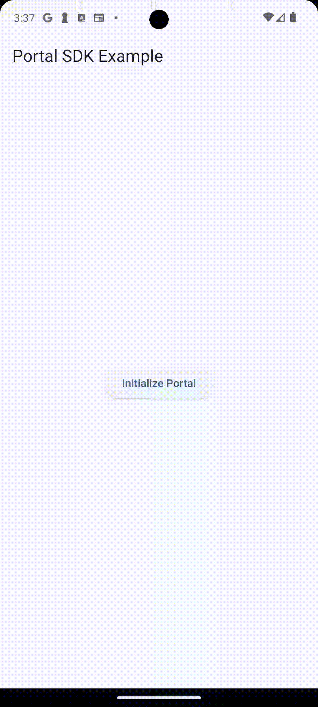

# Portal Flutter SDK Example

This repository demonstrates how to integrate and use the Portal iOS and Portal Android SDK in a Flutter application. It provides a simple interface to initialize the Portal SDK and create a wallet, showcasing a straightforward use case for developers.



---

## Features

- **Initialize Portal SDK**: Users can initialize the Portal SDK with a single button click.
- **Create Wallet**: Users can generate a wallet containing both Ethereum and Solana addresses.
- **Real-time Feedback**: Includes loading indicators during SDK initialization and wallet creation.

---

## Prerequisites

1. **Flutter Setup**: Ensure Flutter is installed on your system. Refer to the [Flutter installation guide](https://docs.flutter.dev/get-started/install).
2. **iOS Environment**: Xcode must be installed for iOS development.
3. **Android Environment**: Follow [the official Flutter guide](https://docs.flutter.dev/get-started/install/macos/mobile-android) on setting up Android for Flutter.
4. **Client API Key**: Obtain Client API key from [Portal Dashboard](https://app.portalhq.io/dashboard).

---

## Getting Started

### 1. Clone the Repository

```bash
git clone https://github.com/portal-hq/portal_flutter.git
cd portal_flutter
```


### 2. Install Dependencies
Ensure all required Flutter dependencies are installed:

```bash
flutter pub get
```


### 3. Configure the API Key
Update the `initializePortal` method in the `PortalExample` class with your Portal client API key:

```dart
const apiKey = "your-api-key";
await platform.invokeMethod('initializePortal', apiKey);
```


### 4. Run the App
Run the Flutter app:

```bash
flutter run
```


---

## Key Features

#### 1. Initializing the Portal SDK
On app startup, users are prompted to initialize the Portal SDK. This is handled via a Flutter `MethodChannel`, invoking the native `initializePortal` method on the corresponding iOS and Android platform.

### 2. Creating a Wallet
Once initialized, users can create a wallet with Ethereum and Solana addresses. The app displays the addresses upon successful wallet creation.

---

## Documentation
- For detailed documentation on integrating the PortalSwift SDK in a Flutter application, refer to the [PortalSwift Flutter iOS Integration Guide](https://docs.portalhq.io/resources/flutter-ios).
- For detailed documentation on integrating the Portal Android SDK in a Flutter application, refer to the [Portal Android SDK Flutter Integration Guide](https://docs.portalhq.io/resources/flutter-android).

---

## Learn more about Portal

Want to integrate Web3 into your app? Visit our site to [learn more](https://portalhq.io), or reach out to Portal to [get a demo](https://www.portalhq.io/book-demo).
